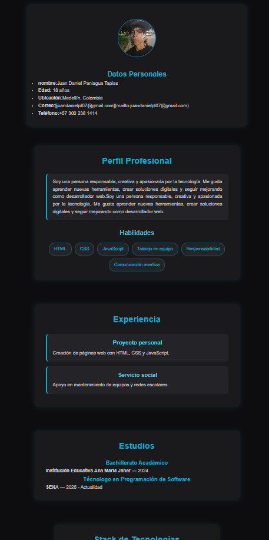

# Mi React Vite Juan Daniel Paniagua en React
# CV Juan Daniel Paniagua

Este es mi portafolio personal creado con React, donde muestro mi hoja de vida, mis proyectos, y mi stack de tecnologías. Fue desarrollado con un enfoque moderno, visual y responsivo.

# instrucciones para ejecutarlo

1. clonar este repositorio:

en tu terminal escribe:
"git clone (https://github.com/juandapro07/cv-react-Juan-Daniel-Paniagua.git)"

2. Configurar espacio para tu proyecto 
Entra a la carpeta he instala las dependencias con "cd nombre-proyecto". Luego instala las dependencias con "npm install", si trabajas con React.

3. Ejecuta tu proyecto
Usa "npm run dev" y ejecuta tu proyecto en el local host

## 🗂 Historial de cambios

### 📅 24 Nov 2025

* Creación de componente dinámico con renderización de listas y condicionales.

### 📅 20 Nov 2025

* Corrección y creación adecuada de props en los componentes **Estudios** y **Experiencia**.

### 📅 13 Nov 2025

* Implementación de importación, exportación y destructuración de props.
* Actualización de archivos modificados.
* Creación del componente **Estudios** con su respectivo CSS.
* Creación del componente **Experiencias** con su CSS.

### 📅 10 Nov 2025

* Creación del componente **Perfil** con sus estilos CSS.
* Creación de la cabecera (Header) e importación en `App`.
* Commit inicial del proyecto con **React y Vite**.
